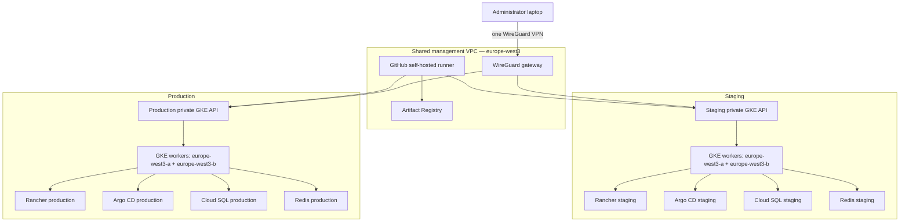

# Order Service — manual runner bootstrap and two private GKE environments

The platform has one explicit bootstrap boundary and two runtime environments:

1. A one-time local Terragrunt bootstrap creates the shared management VPC, WireGuard VPN, Artifact Registry, and persistent GitHub self-hosted runner.
2. After that runner is online, GitHub Actions manually deploys staging and production. Normal workflows never manage the runner stack.

No container is started on the operator laptop. Docker/BuildKit runs only on the GCP self-hosted runner.

## Architecture



The worker node pools use exactly two zones. GKE still manages the regional control plane topology; `node_locations` controls the two worker zones.

Staging and production do not share application data. Each has its own regional-HA Cloud SQL instance, Redis instance, secrets, GKE cluster, Rancher, and Argo CD. The application namespaces (`order-service-staging` and `order-service-production`) also produce distinct Workload Identity principals, so one environment cannot read the other's Secret Manager values. They share only management networking, the VPN, runner, and immutable image repository.

## Repository layout

```text
environments/
├── bootstrap/
│   └── runner/terragrunt.hcl       # invoked once, manually
├── staging/
│   ├── foundation/terragrunt.hcl   # staging SQL/Redis
│   ├── europe-west3/
│   │   ├── terragrunt.hcl          # staging GKE in two worker AZs
│   │   └── platform/terragrunt.hcl # staging Rancher/Argo CD
│   └── global/terragrunt.hcl       # staging LB/WAF
└── production/                     # same independent runtime states

terraform/
├── bootstrap/                      # APIs, state bucket, WIF, CI identities
├── modules/
│   ├── github-runner/              # standalone runner VM module
│   ├── wireguard-vpn/              # single client-to-site VPN module
│   ├── gke/
│   ├── cloudsql/
│   └── redis/
└── stacks/
    ├── management/                 # shared VPC/VPN/runner/registry
    ├── foundation/
    ├── regional/
    ├── platform/
    └── global/

charts/
├── app-of-apps/
└── order-service/
```

Remote state prefixes are independent:

```text
bootstrap/runner/terraform.tfstate
staging/foundation/terraform.tfstate
staging/europe-west3/terraform.tfstate
staging/europe-west3/platform/terraform.tfstate
staging/global/terraform.tfstate
production/foundation/terraform.tfstate
production/europe-west3/terraform.tfstate
production/europe-west3/platform/terraform.tfstate
production/global/terraform.tfstate
```

## One-time manual bootstrap

Requirements:

- Terraform 1.10+ and Terragrunt 1.0.4+;
- Google Cloud CLI authenticated with `gcloud auth login`;
- GitHub CLI authenticated for `Andarol/Test_Task`;
- `wg` only for generating the administrator client key pair;
- no local Docker daemon.

Generate the client key pair once and keep the private key outside the repository:

```bash
umask 077
wg genkey | tee ~/.config/wireguard/order-client.key |
  wg pubkey > ~/.config/wireguard/order-client.pub
```

Run the manual bootstrap:

```bash
export GCP_PROJECT_ID="project-03272afe-c622-4c2b-868"
export WIREGUARD_CLIENT_PUBLIC_KEY="$(cat ~/.config/wireguard/order-client.pub)"

# Required: restrict UDP/51820 to the administrator's public IP.
export WIREGUARD_ALLOWED_SOURCE_CIDR="YOUR_PUBLIC_IP/32"

make bootstrap-runner
```

`scripts/bootstrap-runner.sh` performs only the first-run work:

1. enables APIs and creates the versioned GCS state bucket;
2. creates GitHub WIF and CI service accounts;
3. creates the shared VPC, PSA ranges, NAT, Artifact Registry, VPN VM, and runner VM;
4. passes the short-lived GitHub registration token through Secret Manager;
5. waits until `order-github-runner` is online and destroys that token version;
6. writes the staging and production GitHub repository variables.

The runner archive is pinned to GitHub Actions Runner `2.335.1` and verified using its official SHA-256 digest.

The bootstrap runner state is intentionally outside the normal environment workflow. Do not add `environments/bootstrap/runner` to `deploy-environment.yml`.

## WireGuard client

Read the server public key after bootstrap:

```bash
gcloud compute instances get-serial-port-output order-wireguard \
  --zone=europe-west3-a |
  grep WIREGUARD_SERVER_PUBLIC_KEY |
  tail -1
```

Example client configuration:

```ini
[Interface]
Address = 10.250.0.2/32
PrivateKey = CLIENT_PRIVATE_KEY

[Peer]
PublicKey = SERVER_PUBLIC_KEY
Endpoint = VPN_PUBLIC_IP:51820
AllowedIPs = 10.0.0.0/24, 10.10.0.0/20, 10.20.0.0/16, 10.21.0.0/20, 10.90.0.0/16, 10.110.0.0/20, 10.120.0.0/16, 10.121.0.0/20, 10.190.0.0/16, 172.16.0.0/28, 172.17.0.0/28
PersistentKeepalive = 25
```

Get `VPN_PUBLIC_IP` from:

```bash
cd environments/bootstrap/runner
terragrunt run -- output -raw vpn_public_ip
```

## Private Rancher and Argo CD access

Neither Rancher nor Argo CD receives a public ingress. Connect WireGuard first, then obtain private cluster credentials and create a local tunnel.

Staging:

```bash
gcloud container clusters get-credentials order-staging-europe-west3-gke \
  --region=europe-west3 --internal-ip

kubectl -n cattle-system port-forward service/rancher 9443:443
kubectl -n argocd port-forward service/argocd-server 8443:443
```

Production uses `order-production-europe-west3-gke` and the same commands. Add these local host mappings while the tunnels are active:

```text
127.0.0.1 rancher.staging.internal argocd.staging.internal
127.0.0.1 rancher.production.internal argocd.production.internal
```

Rancher is available at `https://rancher.ENVIRONMENT.internal:9443`; Argo CD is available at `https://argocd.ENVIRONMENT.internal:8443`.

Initial Rancher passwords are stored in Secret Manager as:

- `order-staging-rancher-bootstrap`
- `order-production-rancher-bootstrap`

## Manual runtime deployment

`.github/workflows/deploy.yml` has no push trigger. After the bootstrap runner is online, start `Manual two-environment provision and deploy` with `workflow_dispatch` and select `staging`, `production`, or `all`.

The self-hosted runner executes:

```text
validate
  → build the image once
  → push GIT_SHA to Artifact Registry
  → Terragrunt staging foundation/GKE/platform/global
  → Terragrunt production foundation/GKE/platform/global
```

The environment workflow runs only `terragrunt run -- apply`. It never calls `kubectl apply`. Terraform Helm providers install cert-manager, Rancher, Argo CD, and the root app-of-apps Application. Argo CD reconciles the custom application chart and observability resources from Git.

## Static checks

These checks do not start containers or contact a Kubernetes cluster:

```bash
go test -race ./...
go vet ./...
terraform fmt -check -recursive terraform
make terraform-validate
terragrunt hcl fmt --check
terragrunt hcl validate
make charts-validate
jq empty observability/dashboard.json
```
