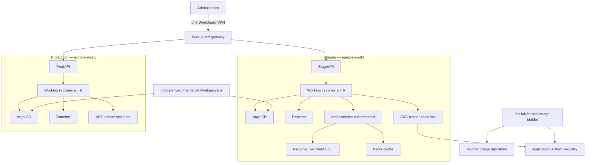

# Order Service — private GKE with independent infrastructure and GitOps releases

The repository has three deliberately separate lifecycles:

1. `environments/bootstrap/runner` creates the shared VPN and Artifact Registry repositories once.
2. `.github/workflows/provision-infrastructure.yml` applies exactly one long-lived Terragrunt component selected by the operator: `foundation`, `cluster`, `gitops`, or `global`.
3. `.github/workflows/build-runner.yml` builds a commit-versioned ARC runner image on a GitHub-hosted builder.
4. `.github/workflows/deploy.yml` runs on an ephemeral ARC runner, builds and deploys staging, and `.github/workflows/promote-production.yml` manually promotes the tested immutable image to production. Argo CD then reconciles the custom Helm chart from Git.

An application release never applies Terraform and never calls `kubectl apply`. No container is started on the operator laptop; ARC creates a short-lived runner pod inside the private GKE cluster only when a job is queued.

## Architecture



GKE manages the regional control planes. Terraform manages a separate autoscaling worker pool spread across two zones. The cluster state is long-lived and is not touched by normal application releases.

## Repository layout

```text
environments/
├── bootstrap/runner/terragrunt.hcl          # one-time VPN/registry bootstrap
├── staging/
│   ├── foundation/terragrunt.hcl            # Cloud SQL and Redis
│   ├── europe-west3/
│   │   ├── cluster/terragrunt.hcl           # GKE control plane and workers
│   │   └── gitops/terragrunt.hcl            # Rancher, Argo CD, root Application
│   └── global/terragrunt.hcl                # load balancer and WAF
└── production/                              # same isolated states

terraform/stacks/
├── management/
├── foundation/
├── cluster/
├── gitops/
└── global/

gitops/environments/
├── staging/values.yaml
└── production/values.yaml

charts/
├── app-of-apps/
└── order-service/
```

For compatibility with the already-created infrastructure, the renamed `cluster` and `gitops` directories retain the existing GCS state prefixes:

```text
staging/europe-west3/terraform.tfstate
staging/europe-west3/platform/terraform.tfstate
production/europe-west3/terraform.tfstate
production/europe-west3/platform/terraform.tfstate
```

The directory names are now explicit while existing cloud resources remain attached to their original states.

## ARC runner bootstrap

Requirements are Terraform 1.10+, Terragrunt 1.0.4+, authenticated `gcloud` and `gh`, plus `wg` for generating the administrator key. Docker is not required locally.

```bash
umask 077
wg genkey | tee ~/.config/wireguard/order-client.key |
  wg pubkey > ~/.config/wireguard/order-client.pub

export GCP_PROJECT_ID="project-03272afe-c622-4c2b-868"
export WIREGUARD_CLIENT_PUBLIC_KEY="$(cat ~/.config/wireguard/order-client.pub)"
make bootstrap-management
```

The `Build ARC runner image` workflow publishes
`europe-west3-docker.pkg.dev/<project>/order-service/runner:<commit>`.
The image contains the pinned Actions Runner, Terraform, Terragrunt, gcloud,
kubectl, Helm and Docker CLI. It is built remotely; Docker is not required
locally.

After the cluster exists, configure the GitHub token and image reference for
the GitOps component and apply it once from the existing bootstrap runner:

```bash
export ARC_ENABLED=true
export GITHUB_ARC_TOKEN="<fine-grained token with repository administration>"
export ARC_RUNNER_IMAGE="europe-west3-docker.pkg.dev/<project>/order-service/runner:<commit>"
```

For the manual infrastructure workflow, store the same values as repository
configuration: variable `ARC_ENABLED=true`, variable `ARC_RUNNER_IMAGE`, and
secret `ARC_GITHUB_TOKEN`.

Terraform installs the ARC controller and one scale set named `arc-staging` or
`arc-production`. The scale set keeps zero idle runners and creates at most one
ephemeral runner pod, so it does not consume a permanent Compute Engine VM.
The token is passed as a sensitive Terraform variable and is never baked into
the runner image.

UDP/51820 accepts connections from dynamic public addresses because the administrator uses DHCP. WireGuard still admits only the configured cryptographic peer.

## Infrastructure provisioning

Run `Manual infrastructure component` and choose one environment and one component. Components are intentionally not chained, so changing GitOps does not recreate the cluster and changing the application does not run Terragrunt.

Initial order for an environment:

```text
foundation → cluster → gitops → application release → global
```

`global` is applied after the first Argo CD sync because its load-balancer backend reads the NEGs created by the application Service.

Production application reconciliation is disabled in `gitops/environments/production/values.yaml` until its foundation outputs are recorded there. This prevents Argo CD from deploying with blank database or Redis endpoints.

## Application release

Run `Deploy staging`. It verifies the Go application, builds one immutable
image tagged with the commit SHA, and updates only staging GitOps values. After
staging validation, run `Promote tested image to production` manually and
provide the exact 40-character image tag. Promotion reuses the staging image;
it never rebuilds the application.

The reusable environment workflow is:

```text
staging: verify → build/push GIT_SHA → update staging values → Argo CD sync
                                                               ↓
production: manual approval → reuse GIT_SHA → update production values
```

Only the image tag changes during a normal release. Terraform owns Rancher, Argo CD, and the root Application; Argo CD exclusively owns the application chart and observability resources.

## Private access

Connect WireGuard, fetch internal cluster credentials, and open local tunnels:

```bash
gcloud container clusters get-credentials order-staging-europe-west3-gke \
  --region=europe-west3 --internal-ip

kubectl -n cattle-system port-forward service/rancher 9443:443
kubectl -n argocd port-forward service/argocd-server 8443:443
```

Production uses `order-production-europe-west3-gke`. Rancher bootstrap passwords are stored in Secret Manager as `order-staging-rancher-bootstrap` and `order-production-rancher-bootstrap`.

## Static checks

```bash
go test -race ./...
go vet ./...
terraform fmt -check -recursive terraform
make terraform-validate
terragrunt hcl fmt --check
make charts-validate
```
